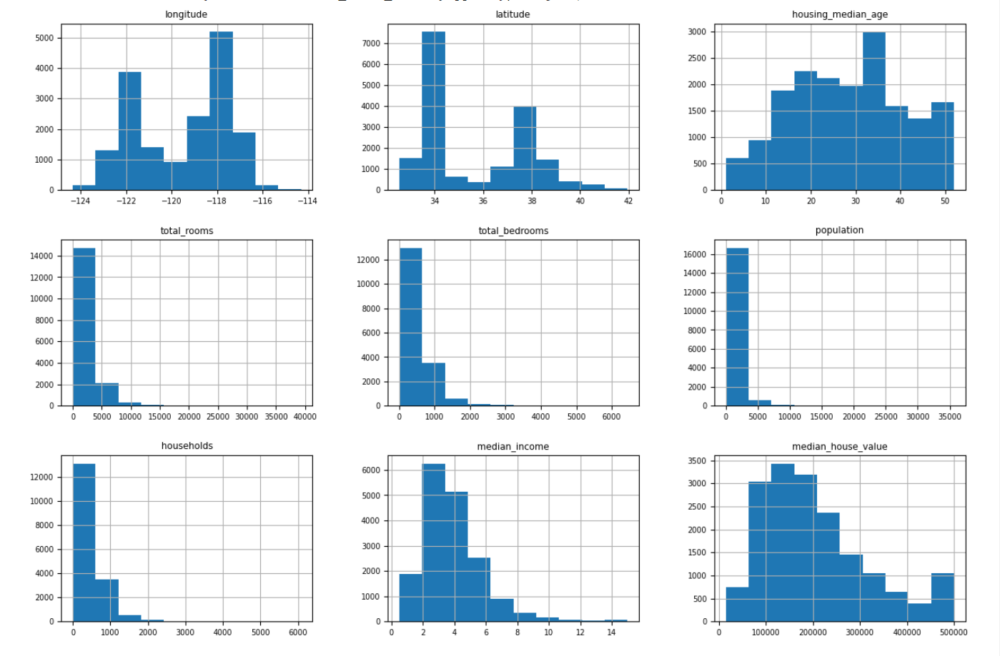
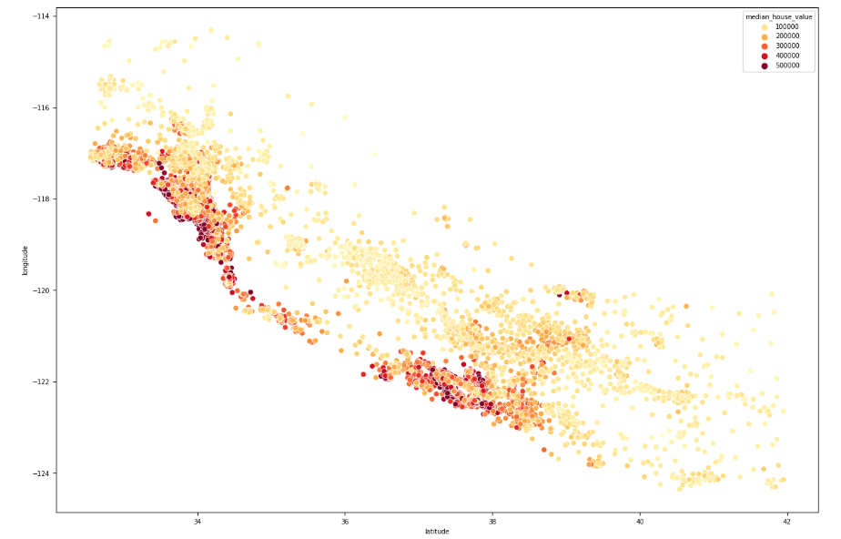
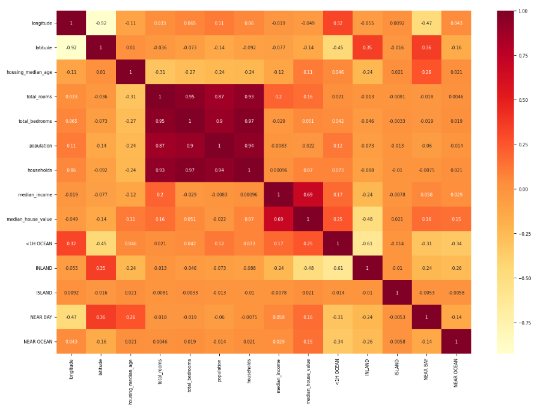
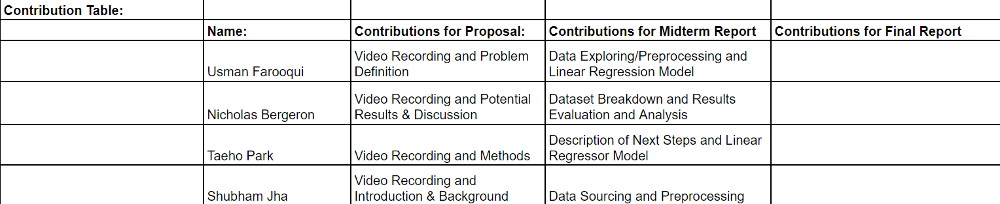

# House Price Prediction Model
Project Group 114: Nick Bergeron, Taeho Park, Usman Farooqui, Shubham Jha

## Introduction/Background
This proposal describes a Machine Learning project that uses the dataset from the 1990 California census to forecast home values. Our goal is to create a prediction model that uses a variety of features and past data to reliably estimate residential property values. The House Price Prediction Model project addresses the growing demand for reliable property valuation models, benefiting homebuyers, sellers, and investors. We will use machine learning methods to build a strong model for high-accuracy property value estimation by utilizing a diversified dataset that includes property attributes, geographical data, and historical pricing information [1].  This proposal will go into detail about our technique, approach, and possible effects of our projections on the housing market.

## Problem Definition
Purchasing a home is a major financial investment for countless people in the US, and with market fluctuations, it can be hard to know the optimal time to buy a home. With this predictive model, potential homeowners can gauge a timeline for the ideal opportunity to purchase a home, providing some peace of mind and clarity. Additionally, this model can indicate the ideal time for homeowners to sell by predicting future house values. Overall, our model will help bring some certainty to an otherwise volatile market.

## Methods
### Supervised Learning

#### Data Preprocessing:
(histograms before applying log_normal)  
  

(histograms after applying log_normal) 
 

During the initial phase of our data cleaning process, we identified and eliminated all instances of null entries and any data points that were deemed redundant or of no value to our analysis. Our examination of the dataset through histograms revealed that the distribution of variables such as total_rooms, total_bedrooms, population, and households is notably right-skewed. To address this and normalize the data we applyied a logarithmic transformation , which brought the distribution of these variables closer to a standard bell curve shape.

Furthermore, we explored the relationship between ocean proximity and housing prices. The visual data suggests that properties located nearer to the coast tend to have higher median house values. To quantitatively assess this observation, we have implemented one-hot encoding for the 'ocean_proximity' feature. This transformation will enable us to incorporate this categorical variable into our models more effectively and examine its potential impact on the median house value.

Lastly, we created a new heatmap to visually represent the correlations between housing value and the newly encoded 'ocean_proximity' data, along with other relevant variables. This will help in gaining a more nuanced understanding of the factors that influence house prices in our dataset.

#### Linear Regressor:
we developed a linear regression model using Python's scikit-learn library to predict median house values based on a set of housing-related attributes. After importing the necessary modules, we prepared our training data by dropping the target variable 'median_house_value' from our feature set and assigning it to our target variable, y_train. We then instantiated the LinearRegression model and fitted it to our training data to create a predictive model. To ensure the model's compatibility with the test data, we also performed similar preprocessing steps on the test set, including joining features and target variables, transforming certain features using the natural logarithm for normalization purposes, and handling categorical data. Finally, we evaluated the model's accuracy by predicting the median house values of the test set and calculating metrics such as the mean squared error and the coefficient of determination, or R² score.

#### Libraries:
Pandas, Matplotlib, Seaborn

## Results and Discussion
### Dataset Breakdown
Our dataset consists of property values [provided by Kaggle](https://www.kaggle.com/datasets/camnugent/california-housing-prices) from the 1990 California census for all residential properties in each district. This dataset was very straightforward to work with and encompassed more than enough datapoints for our training model to work with while giving a wide variety of types of properties for our model. For each property, there are varables describing information about both the house and the people living in it. Each row corresponds to a census block group, which is the smalles geographical unit the U.S. census publishes data for. While the data may seem old, age does not matter for the purpose of training our model, and inflation is very easy to adjust for by year. 
### Results
#### Linear Regression
After training our linear regression model, the next step was to analyze our accuracy using both Root Mean Squared Error and a score for the Coefficient of Determination Regression. For our linear regression model, the RMSE and Coefficient of Determination Regression was 65150.27 and 0.6793 respectively. The RMSE is not normalized, so on average our model was off by around $65000 for each property value. As expected a linear regression model is not the most accurate at predicting the real data points, but the primary reason of the RMSE and Coefficient of Determination Regression is to compare the accuracy for each of our models. Once we have more working models to compare these results to, we can begin determing acceptable margins of error for each model. Overall our model had about an average performance, the dataset was fairly straightforward and easy to work with which helped, but there is room to improve with this model. Primarily in caluclating the influence each variable has on the overall property value. Beyond just analyzing accuracy, our results also included visualizing the effect of ocean proximity on housing prices to show how one variable can have a significant impact on the property value. By graphing each data point using it's latitude and longitude, it clearly shows how proximity to the ocean can raise the property value: 

Along with this geographical visualization, a heatmap was created using one-hot encoding for the "ocean_proximity features".

This visualization will allow us to better understand how each variable affects the overall property value, and improve our model going forward.
#### Ridge Regression
The first improvement made to our linear regression model was the implementation of a Ridge Regression Model. Ridge regression is designed to address issues caused by multicollinearity(where independent variables are highly correlated) in linear regression models. In the case of our linear regression model, multicollinearity was a minor issue as the Ride Regression addition marginally improved the performance of our model. RMSE decreased from 65413.56 to 65397.33 and Coefficient of Determination Regression Score increased from 0.6763 to 0.6765. If multicollinearity had a significant impact on our original model, ridge regression would have improved its performance by a higher degree.
#### Random Forest
The second model we created was a Random Forest Model. Random Forest Models apply the general technique of bootstrap aggregating, or bagging, to pick a random attribute at every split. Ideally this would drastically reduce the variance of the final classifier. The use of a Random Forest Model should reduce the risk of overfitting and improve accuracy, at the cost of slower training. Our Random Forest Model has significantly improved performance over the original and modified Linear Regression models with a RMSE of 49176.32 and a Coefficient of Determination Regression Score of 0.8171 using default hyperparameters. We then attempted to optimize our hyperparameters using cross validation. This lead to only a marginal increase in performance with an RMSE of 48867.95 and a Coefficient of Determination Regression Score of 0.8193.
#### Gradient Boosting

## Next Steps
If we decide to move forward with our project, there are several key areas we can plan to focus on to enhance the performance and applicability of our house price prediction model:

1.) Advanced Feature Engineering: We'll delve into sophisticated feature engineering to uncover deeper insights from our data.

2.) Model Ensemble Techniques: We can combine the strengths of Random Forest and Ridge Regression using ensemble methods like stacking.

3.) Feature Importance Analysis: A thorough analysis of feature importance in our Random Forest model will help us refine our feature set.

4.) Cross-Validation and Evaluation: We'll employ cross-validation for robustness and use diverse metrics for a comprehensive evaluation of our models.

5.) Error Analysis: Investigating the errors our models make will be crucial for further refinement.

6.) Model Interpretability: We aim to enhance the interpretability of our complex models, using tools like SHAP or LIME for clearer insights.

7.) Deployment Strategy: If we plan to deploy our model, we can potentially do it through a web application or API.

8.) Real-world Testing and Feedback: Testing with real-world data and establishing a feedback loop will be key for continuous improvement.

8.) Documentation and Reporting: We will maintain detailed documentation for transparency and future enhancements.

9.) Ethical Considerations and Bias Mitigation: Ensuring fairness and non-discrimination in our model's predictions is a top priority. There is a lot of people doing similar work as us so we need to ensure we are not using someone else's intellectual property.

## Gantt Chart
https://bit.ly/ml-gantt-chart

## Contribution Table

## References
[1] N. Ghosalkar and S. Dhage, Real estate value prediction using linear regression | IEEE conference ..., https://ieeexplore.ieee.org/document/8697639 (accessed Oct. 6, 2023).\
[2] R. Gencay et al., “A prediction comparison of housing sales prices by parametric versus semi-parametric regressions,” Journal of Housing Economics, https://www.sciencedirect.com/science/article/abs/pii/S105113770400004X (accessed Oct. 6, 2023).\
[3] A. Nguyen, Housing price prediction,https://cs.union.edu/Archives/SeniorProjects/2018/CS.2018/files/nguyena2/nguyena2-499-report.pdf (accessed Oct. 6, 2023).
